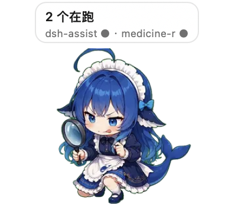
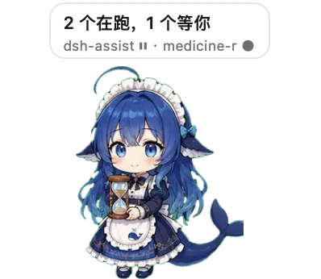
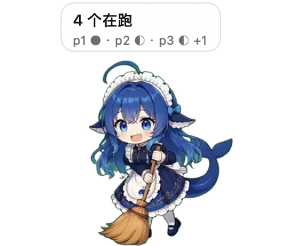
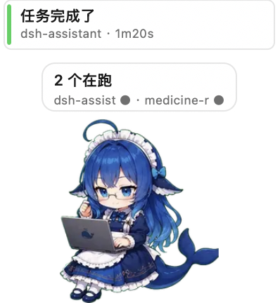
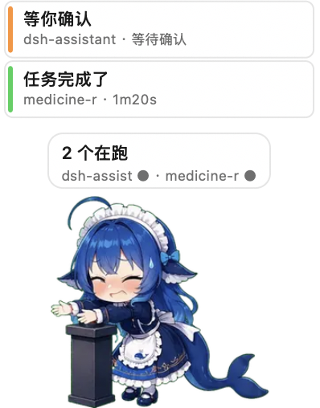
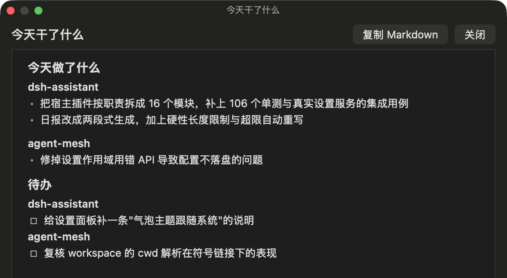

<div align="center">

# DSH小助手 🐋

**住在桌面上、由 DeepSeek Harness 真实工作状态驱动的 Agent 伴侣。**

入口属于 DSH，生命周期属于 DSH，显示层属于桌面。

[使用](#使用) · [外观与互动](#外观与互动) · [今天干了什么](#今天干了什么) · [参考与致谢](#参考与致谢) · [已知边界](#已知边界)

 · [](LICENSE) ·  · 

</div>

DSH小助手不是需要单独启动的桌宠应用：它由 DSH 插件拉起，跟着 DSH 一起启动和退出，
以透明、无边框、始终置顶的原生窗口待在桌面上。切到 VS Code、浏览器或全屏应用之后，
照样能看到 DSH 当前在思考、在执行、在等你确认，还是已经完成。

它只显示**真实发生的事**：状态来自 DSH 的会话事件 —— 不读屏幕、不根据模型名猜推理强度、
也不编造完成度。几个项目一起跑时，气泡只给两行关键信息：谁在跑、谁在等你。

> 当前版本 `0.1.0` · macOS（Apple Silicon / Intel 通用二进制）· 仓库自带编译好的 helper
> 与素材包，clone 下来就能跑，不需要 Xcode

## 状态展示

七个耐久状态各自有动作与文案，同一状态还会随机换姿势，不会一直重复同一张图。

| 待机 | 思考 |
| --- | --- |
|  |  |

| 执行 | 等你确认 |
| --- | --- |
|  |  |

| 完成 | 出错 |
| --- | --- |
|  |  |

多项目并行：



完成、出错、**等你确认**各会另起一条通知，独立于状态气泡钉在宠物上方，
点一下就切到那个会话 —— 状态气泡可能正被别的项目占着，通知不会。

| 完成通知 | 等你确认（这条也能点） |
| --- | --- |
|  |  |

## 使用

### 装到 DSH 里

```bash
dsh plugin --profile desktop add github:vianvio/dsh-assistant
```

`--profile` 填你实际在用的那个（桌面端是 `desktop`，Web 端是 `web`）。
这条命令背后是 pnpm：装完包之后，它会**自动**把声明了 `dsh.bundle` 的依赖加进
profile 的 `dsh.profile.bundles` —— 不用手改 `package.json`。

重启 DSH 后，桌面右下角会出现宠物，设置面板里多一张「DSH小助手」卡片。

以后升级：

```bash
dsh plugin --profile desktop update dsh-assistant
```

### 改这个插件本身

改用 link，改完不用重装：

```bash
git clone https://github.com/vianvio/dsh-assistant.git ~/dsh-assistant
dsh plugin --profile desktop add link:$HOME/dsh-assistant
```

### 自己构建（可选）

仓库里带了编译好的 macOS helper 与素材包，上面两种装法**都用不到这些命令**；
只有改了原生端或想换素材时才需要：

```bash
npm run build:helper    # 编译原生 helper（需要 Xcode 命令行工具）
npm run build:pack      # 重新生成素材包
npm run verify          # 自检：素材 / helper / 模块 / 握手 / 状态归约
npm test                # Node 单测（含真实 DSH 设置服务的集成用例）
npm run probe           # 不经 DSH，直接驱动宠物跑一遍状态与动作（肉眼验收）
```

## 外观与互动

设置面板里的一张「DSH小助手」卡片就是全部开关：

| 设置 | 默认 | 说明 |
| --- | --- | --- |
| `enabled` | 开 | 关闭后立即收起桌面窗口 |
| `scale` | 0.4 | 0.15 – 2.0，1 = 原始尺寸；右键菜单有 40% / 55% / 70% / 100% 四挡 |
| `bubbleEnabled` | 开 | 是否显示气泡 |
| `bubbleTheme` | `light` | 浅色气泡配黑字，深色配白字 |
| `reducedMotion` | 关 | 减少动效 |
| `soundEnabled` | 关 | 完成 / 出错时响一声 |
| `includeSubagents` | 关 | 允许子 Agent 抢占宠物状态 |
| `backgroundSummary` | 关 | 任务后台总结（见下） |

宠物可以直接拖着走，位置与上面的偏好都记在本机（`$DSH_HOME/dsh-assistant/layout.json`）。

右键菜单：**投喂点心 / 戳一下 / 夸夸它 / 摸摸头 / 回到原位 / 今天干了什么**。
左键点身体也会摸头，四个互动动作在菜单、点击、设置面板三处是同一套。

## 今天干了什么

右键宠物 →「今天干了什么」（或设置面板里的「生成日报」）：回顾当天的会话，产出一份
「今天做了什么 + 待办」的 markdown —— **按项目聚合**，长度有硬性上限，写不下就自动重写一轮。

生成完在宠物上方弹一条通知，**点一下打开弹窗**；弹窗里有「复制 Markdown」按钮，
复制的是原文，不是渲染结果。

生成日报用的会话是**隐藏会话**：不会出现在左侧列表里，也不会弹系统通知。

打开设置里的「任务后台总结」后，它改成**边干活边攒**：会话每次压缩时先在后台提炼一段
已完成的内容存着，点日报时只补增量、再汇总 —— 不用等到晚上才有一份完整回顾。



## 参考与致谢

这个项目的两半（**画面**与**状态**）都站在别人的成果上。没有下面这两个仓库，
就不会有现在的 dsh-assistant —— 特此致谢。

### 🐋 角色素材 · [Sutera-Diffusus/dsh-whale-musume](https://github.com/Sutera-Diffusus/dsh-whale-musume)

> MIT License · Copyright © 2026 **Sutera-Diffusus**
> DeepSeek Harness 桌宠插件：元气鲸鱼娘陪你写代码

本项目默认的 **88 段角色素材全部来自这个仓库**。上游是静态姿态图，我们做了三件加工：
统一高度（切状态时角色大小不跳）、按显示尺寸烘焙成 WebP、其中一部分用百炼图生视频
生成微动作再抠像对齐成序列帧。

**加工不改变上游的许可与署名要求：角色形象版权仍归原作者**，本项目只以 MIT 分发代码与
加工后的素材。想换成自己的角色：把图丢进一个目录，改 `scripts/build_pack.py` 顶部的
`STATE_ASSETS` / `ACTION_ASSETS`，重跑 `npm run build:pack` —— 宿主与原生端都不用改。

### 🐟 原生悬浮窗骨架 · [QCYTSN/dsh-dafeiyu](https://github.com/QCYTSN/dsh-dafeiyu)

> MIT License · Copyright © 2026 **QCYTSN**

「原生透明面板 + stdio JSON 协议 + 会话事件归约」这条路线，是这个仓库用**生产代码**先跑通的。
我们照着它做，省掉了"原生方案在 DSH 里到底行不行"那一段最贵的试错；之后在帧内存、
VoiceOver 可访问性、僵尸进程与布局持久化上各自做了加固。

### 其它

- 素材生成依赖 **阿里云百炼**（图生视频模型），管线脚本在 `scripts/`；
- 配色与排版参考了 DSH 自身的界面规范（深/浅两套气泡配色）。

完整署名与许可见 [`THIRD_PARTY_NOTICES.md`](THIRD_PARTY_NOTICES.md)。

## 已知边界

- **平台**：原生 helper 目前只有 macOS（AppKit）。Windows/Linux 要么重写面板层，
  要么退回 Electron 子窗口方案（会失去「全屏应用之上」这一条）。
- **分发**：.app 是 ad-hoc 签名。别人从浏览器下载会被 Gatekeeper 拦，正式分发需要
  Developer ID + 公证。
- **素材体积**：`assets/pack` 约 46MB（88 段 × 30 帧）；`assets/motion` 另有几百 MB
  的源 MP4，已加进 `.gitignore`。
- **素材来源**：默认取自 [dsh-whale-musume](https://github.com/Sutera-Diffusus/dsh-whale-musume)
  （MIT, © 2026 Sutera-Diffusus，见[参考与致谢](#参考与致谢)）。想换角色：
  把图丢进一个目录、改 `scripts/build_pack.py` 顶部的 `STATE_ASSETS` / `ACTION_ASSETS`，
  重跑 `npm run build:pack` 即可，宿主与原生端都不用改。
